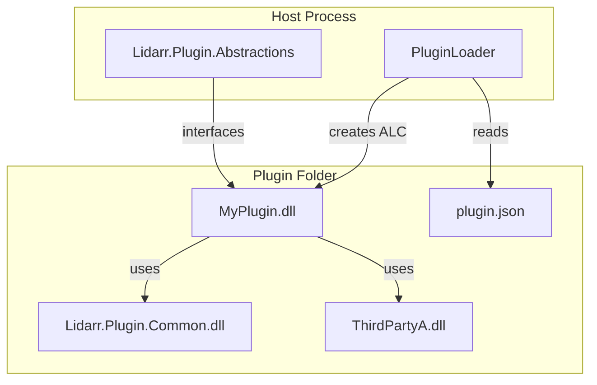

# Architecture

This page explains how the shared library is split between a stable host ABI and plugin-owned implementation code.

## Components
| Component | Owner | Purpose |
|-----------|-------|---------|
| `Lidarr.Plugin.Abstractions` | Host | Public contracts (`IPlugin`, DTOs, manifest helpers) that live in the default AssemblyLoadContext. Versioned via SemVer with strict public API baselines. |
| `Lidarr.Plugin.Common` | Plugin | Implementation helpers, HTTP utilities, download orchestrator, caching, etc. Each plugin ships its own copy alongside third-party dependencies. |
| Host loader | Host | Discovers plugin folders, validates manifests, loads plugins into isolated collectible AssemblyLoadContexts. |
| Plugin package | Plugin author | Folder containing plugin DLL, Common, third-party dependencies, and `plugin.json`. |

## Design principles
- **Stable ABI**: Abstractions change additively in minor releases. Public API baselines fail CI if surface changes without an intentional update.
- **Isolated implementation**: Common is treated as plugin-private implementation detail; breaking changes are acceptable with a major bump because each plugin controls its dependency set.
- **Explicit contracts**: Only types defined in Abstractions cross the host ↔ plugin boundary. No shared static state or Common-specific DTOs leave the plugin ALC.
- **Composable utilities**: Common provides opt-in helpers (HTTP resilience, download orchestrator, caching) rather than inheritance-heavy frameworks.

## Versioning
- `Lidarr.Plugin.Abstractions` → SemVer, fixed `AssemblyVersion` per major (e.g., `1.0.0.0` for all 1.x). When the public surface changes, update `src/Abstractions/PublicAPI.*` and add migration notes in [`migration/BREAKING_CHANGES.md`](../migration/BREAKING_CHANGES.md).
- `Lidarr.Plugin.Common` → SemVer, plugin-private. Plugin authors choose when to adopt new features.
- The repository tracks supported TFMs and host versions in [`concepts/COMPATIBILITY.md`](COMPATIBILITY.md).

## Contracts and responsibilities
- **Host**
  - Ship the Abstractions package with the application.
  - Validate `plugin.json` before load.
  - Create collectible ALC per plugin and unload on update or removal.
- **Plugin authors**
  - Reference Abstractions as compile-time only dependency.
  - Package Common and third-party dependencies inside plugin folder.
  - Provide manifest metadata targeting the host ABI.
- **Library maintainers**
  - Enforce public API baselines.
  - Keep documentation accurate through the docs CI guardrail.
  - Communicate breaking changes in the migration guides.

## Related docs
- [Plugin isolation](PLUGIN_ISOLATION.md)
- [Compatibility matrix](COMPATIBILITY.md)
- [Release policy](../dev-guide/RELEASE_POLICY.md)
- [Migration guides](../migration/FROM_LEGACY.md)
